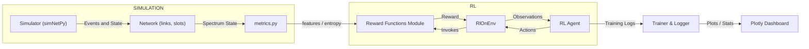

# DREAM-ON-GYM V3 — ULTRA (Optimized, Enterprise-ready)

 [](licenses/LICENSE_GYM.md)  [](https://www.python.org)  [](https://github.com/crismoraga/dream-on-gym-v3)

 [](docs/docs/index.md)  [](examples/gym/example1.py)  [](dreamongymv2/reward_functions/quick_evaluation.py)  [](https://github.com/crismoraga/dream-on-gym-v3)

<!-- Banner -->


*Nota: Si tu cliente no renderiza SVG, existe una versión PNG en `assets/banner.png`.*

<!-- Icon: use Markdown image - PNG fallback exists in assets/icon.png -->


---

Un framework avanzado de investigación y desarrollo para entrenamiento por Deep Reinforcement Learning (DRL) en Elastic Optical Networks (EON). DREAM-ON-GYM-V3 es la evolución y reingeniería de **DREAM-ON-GYM-V2**, aportando mayor estabilidad, reproducibilidad, y un conjunto completo de utilidades para evaluación y producción: reward engineering avanzado, pipelines de experimento y dashboards listos para usar.

> ¿Por qué V3? V3 está diseñado para investigadores y equipos que necesitan reproducibilidad, comparativa experimental y producción: mejores métricas, integración con SB3, evaluaciones automatizadas y visualización profesional.

---

## 📚 Índice

- Resumen y Valor
- Que hay de nuevo en V3
- Caracteristicas principales
- Instalacion rapida
- Quickstart / Demo
- Ejemplos y Entrenamiento (PPO)
- Arquitectura & Diagrama Mermaid
- Metricas & Reward Engineering
- Evaluacion y Pipelines reproducibles
- Migracion V2 → V3 (guia rapida)
- Contribuir y contactos
- Changelog & Licencia

---

## 📌 Resumen & Valor

DREAM-ON-GYM-V3 es una plataforma de investigación enfocada en:

- Entrenamiento de agentes DRL sobre una simulación realista de redes ópticas elásticas.
- Evaluación reproducible de reward functions (incluye una `SpectralEntropyAdaptiveReward` novedosa basada en entropía espectral de la red).
- Fácil integración con Stable-Baselines3 y Gymnasium para experimentos científicos y pruebas de producción.

Valor diferencial:

- Reproducibilidad: `run_experiments.py` exporta JSON y PNG; seeds configurables.
- Reusable experiments: scripts parametrizados para topologías NSFNet, GermanNet, ItalianNet, y más.
- Integración lista para pipelines empresariales: CI/CD, benchmarks y visualización interactiva.

---

## 🔄 Que hay de nuevo en V3

| Área | DREAM-ON-GYM-V2 | DREAM-ON-GYM-V3 (ULTRA) |
|------|------------------|-------------------------|
| Core | Implementaciones iniciales y ejemplos | Reingeniería: modularidad, estabilidad y testeo reproducible |
| Reward functions | Básicos (+1/-1) | 5 rewards: Baseline, QoT-Aware, Multi-Objective, Fragmentation-Aware, SpectralEntropyAdaptiveReward (NOVEL) |
| Evaluación | Scripts seccionados | `quick_evaluation`, `full_evaluation`, `run_experiments` (pipelines reproducibles) |
| Visualización | Básica | Radar, Heatmaps, Boxplots, distribution plots + dashboard Plotly |
| Integración | Stable-Baselines (limitado) | Gymnasium + Stable-Baselines3 + sb3-contrib, compatible con PyTorch/TF backends |
| Reproducibilidad | Parcial | Resultados exportables (JSON/PNG) y configuración determinista (seeds) |

---

## ⚙️ Características principales

- Soporte full EON con multi-bandas (L,C,S,E,O) y slots por enlace.
- Reward engineering avanzado: QoT-aware, fragmentation-sensitive y adaptativo por entropía.
- Funciones de métricas integradas en `metrics.py` (fragmentation ratio, entropy, utilization, QoT estimators).
- Scripts de evaluación (rápidos y completos) y dashboards con visualizaciones automáticas.

---

## 💾 Instalación rápida

Recomendado: Python 3.10, entornos virtuales. Ejemplo PowerShell (Windows):

```powershell
python -m venv .venv310
. .\.venv310\Scripts\Activate.ps1
pip install -U pip setuptools wheel
pip install -e .
```

Dependencias principales: numpy, gymnasium, stable-baselines3, sb3-contrib, tensorflow (opcional), matplotlib, pandas, mpi4py.

Para GPU: instale la versión de `tensorflow` y `torch` con soporte CUDA acorde a su entorno.

---

## ✨ Quickstart — Demo y evaluación rápida

1. Demo interactiva (evaluación y ejemplos):

```powershell
python -m dreamongymv2.reward_functions.demo
```

1. Quick evaluation con generación de gráficos:

```powershell
python -m dreamongymv2.reward_functions.quick_evaluation
```

1. Evaluación completa con simulaciones y reporte:

```powershell
python -m dreamongymv2.reward_functions.full_evaluation
```

1. Ejecutar ejemplo de entrenamiento (PPO) — ver `examples/gym`:

```powershell
python -m dreamongymv2.reward_functions.examples
```

---

## 🧪 Ejemplo de entrenamiento (PPO)

Snippet mínimo con Stable-Baselines3:

```python
from stable_baselines3 import PPO
from dreamongymv2.gym_basic.envs.rl_on_env import RlOnEnv
from dreamongymv2.reward_functions import MultiObjectiveReward

env = RlOnEnv(reward_fn=MultiObjectiveReward())
model = PPO('MlpPolicy', env, verbose=1)
model.learn(total_timesteps=10000)
model.save('ppo_multiobj_v3')
```

> Nota: Revisa `examples.py` para ejecuciones reproducibles con seeds y checkpoints.

---

## 🏗 Arquitectura (visión general)



---

## 🧮 Metricas y Reward Engineering

- El módulo `metrics.py` provee:

- Fragmentation metrics: external, internal (Shannon entropy) y average-block size
- Network utilization: por enlace y promedio de red
- QoT estimators: OSNR heuristics para estimar QoT

Reward functions implementadas:

1. `BaselineReward`: +1 asignado / -1 bloqueado
2. `QoTAwareReward`: integra OSNR y distancia (penaliza enlaces largos)
3. `MultiObjectiveReward`: combinación ponderada (blocking, fragmentation, throughput)
4. `FragmentationAwareReward`: penaliza fragmentación externa e interna
5. `SpectralEntropyAdaptiveReward` (NOVEL): usa entropía de Shannon para zonificar la red y ajustar bonificaciones/penalizaciones

---

## 📊 Evaluacion y Pipelines reproducibles

- `quick_evaluation.py`: run rapide, guarda PNG en `reward_functions/plots`
- `full_evaluation.py`: corre el simulador para múltiples cargas y topologías, guarda JSON y plots
- `run_experiments.py`: pipeline completo para replicar experimentos (multi-topologías, ρs, repeticiones)

**Reproducibilidad:** Configure seeds antes de `sim.init()` para garantizar resultados determinísticos (ej. `sim.setSeedArrive(42)` etc.).

---

## 🔬 Migracion V2 → V3 — Guia rápida

Si vienes desde V2, los puntos clave:

- API de reward: ahora el `calculate()` acepta `allocated` y `network` (más rico en contexto).
- Los scripts de evaluación (`quick_evaluation`, `full_evaluation`) reemplazan pruebas ad-hoc y facilitan benchmarking.
- `SpectralEntropyAdaptiveReward` es una función nueva que exige `metrics.get_network_spectrum_state(network)` o equivalente.
- Para migrar wrappers: asegúrate de inyectar la instancia `reward_fn` al crear el env: `RlOnEnv(reward_fn=SpectralEntropyAdaptiveReward())`.

---

## 📷 Visualizaciones y cómo crear GIFs

- Los plots generados se guardan en `dreamongymv2/reward_functions/plots`. Ejemplos:

- `blocking_probability.png`
- `rewards.png`
- `radar.png` (comparativa multidimensional)

Para crear GIFs a partir de PNGs (ImageMagick / ffmpeg):

```bash
magick convert -delay 20 -loop 0 plots/radar_*.png plots/radar.gif
# or
ffmpeg -framerate 10 -pattern_type glob -i 'plots/radar_*.png' -vf "scale=800:-1" plots/radar.gif
```

---

## 🧰 Para integraciones enterprise

- Use `run_experiments.py` y exporte JSON + PNG como artefactos para su pipeline CI/CD.
- Para entrenamiento intensivo, configure GPU y entorno reproducible.
- Para despliegues research → production: validar reproducibilidad, tests y métricas en cada release.

---

## 👩‍💻 Contribuir

1. Fork & branch: `git checkout -b feature/mi-feature`
2. Agrega tests reproducibles y un ejemplo mínimo
3. Abre PR con descripción, métricas y artefactos (plots, CSV, JSON)
4. Ejecuta `pytest` y valida ejemplos de `examples/gym`

---

## 📜 Changelog & Licencia

- **v3.0.0** — Reingeniería, 5 reward functions, pipelines y dashboards
- **v2.0.0** — Implementación inicial: ejemplos y la conexión inicial con Flex-Net-Sim

Licencias: revisa `licenses/` para los detalles de licencias incluidas (Flex-Net-Sim y otros componentes)

---
